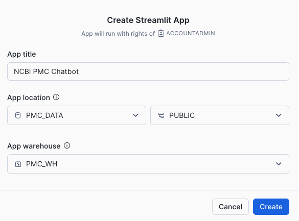

**NCBI PUBMED CHATBOT**

*Owner: Namitha Patil, namitha.patil@snowflake.com*

Description: Snowflake Cortex Search Service and Cortex LLMs power this Chatbot against NCBI PMC Open Access Articles. 

Data Source: AWS Open Data Exchange: https://aws.amazon.com/marketplace/pp/prodview-qh4qqd6ebnqio

Related Blog Post: https://medium.com/snowflake/streamline-scientific-biomedical-research-with-snowflake-cortex-search-for-pubmed-6b9d5a2a383d 

SETUP INSTRUCTIONS
1. PMC_Chatbot_Setup.sql 
2. Import snowflake_notebook_explore_service.ipynb into snowflake notebook
3. Copy SiS_Chatbot.py into a Streamlit in Snowflake App
     NOTE: All NCBI.gov links embeded in the SiS app require opening using right click "open in new tab/window" 

